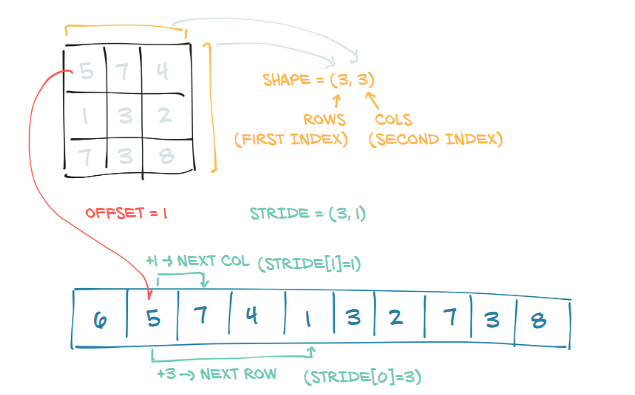

# Tensors - A first tour

In this first tour, we'll discuss the most basic type of tensors in Pytorch, dense arrays. Tensors will be discussed in a later markdown in much more details.

[Tensors in Pytorch](https://pytorch.org/docs/stable/tensors.html#torch-tensor) are simply multidimensional arrays that can store one data type. Tensors can be created using the `torch.tensor()`constructor or directly from a list object or a numpy array.

````python
import numpy as np
import torch

# From a numpy array
ex_tensor = torch.tensor(np.array([[1, 2, 3],
                      [4, 5, 6],
                      [7, 8, 9]]))
ex_tensor
# tensor([[1, 2, 3],
#         [4, 5, 6],
#         [7, 8, 9]], dtype=torch.int32)
````

Pytorch stores tensors as contiguous blocks in memory. One can access the underlying storage by using the `storage` method.

````python
ex_tensor.storage()
# 1
# 2
# 3
# 4
# 5
# 6
# 7
# 8
# 9
# [torch.IntStorage of size 9]
````

We can see that our tensor is stored row-wise and its storage is different from the layout we get once we print the tensor. The secret to this is that pytorch tensors come bundled with a [number of attributes](https://pytorch.org/docs/stable/tensor_attributes.html#tensor-attributes-doc) that allow it to represent the underlying data in the way the user want it, without any modification to the storage in memory. This allows pytorch to be efficient when doing a bunch of operations such as reshaping.

Now, to go from the underlying storage to the tensor itself, there are three elements that define this mapping.

- **Shape (or Size):** this defines how many elements the tensor has in its dimension.

- **Stride:** The stride defines how many steps along the storage one has to move in order to get the next element in the corresponding dimension in the tensor (wow, that's a mouthful). Imagine you'd like to get to the third element in the second row of `ex_tensor`, you'd write `ex_tensor[1, 2]` , but in the underlying storage, one has to move 5 steps from the first element to get to number 6.  Visually, it's crystal clear but how does pytorch make this calculation. Let's inspect the output of the call to `stride`.

  ````python
  ex_tensor.stride()
  # (3, 1)
  ````

  This output is saying:

  At any position in the storage, if we want to get the element in the next row while staying in the same column, one has to move 3 steps. Imagine  being 	at index [0, 1] that is equal to 2, to get to the number at index [1, 1] which is equal to 5 in our example, one has to move 3 steps along storage. To move from one column to another, only 1 step is necessary. 

- **Offset:** Imagine creating a second tensor from `ex_tensor` like this

  ````python
  ex_sec_tensor = ex_tensor[1:, :]
  ex_sec_tensor
  # tensor([[4, 5, 6],
  #         [7, 8, 9]], dtype=torch.int32)
  ````

  This tensor uses the same underlying as `ex_tensor` and doesn't use a new storage. But as it only starts from the second row of `ex_tensor`, the reading from storage is offset by 3, which the number of steps necessary to get to the first element of `ex_sec_tensor` in the storage. What one should remember is that when reshaping or indexing into tensors, you're just having a new view of the underlying storage.  

This image from **[Deep Learning with Pytorch](https://www.manning.com/books/deep-learning-with-pytorch)** (which I truly encourage you to read) sums it all up.




[WIP]

The most important attributes are

````python
# .shape gives the shape of the tensor
ex_tensor.shape
# torch.Size([3, 3])

# Type of the elements of the tensor
ex_tensor.dtype
# torch.int32

# Whether the tensor is stored in CPU or GPU memory
ex_tensor.device
# device(type='cpu')
````


Tensors support a wide variety of operations. These operations have numpy-like syntax.